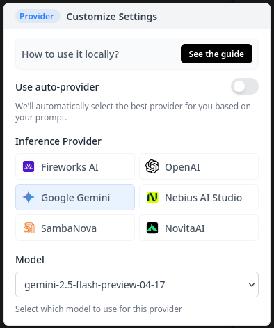

# FlashSite

FlashSite is a powerful web-based tool for rapidly creating and deploying websites using AI. Built as an extension of [DeepSite](https://huggingface.co/spaces/enzostvs/deepsite), FlashSite adds several powerful features to enhance your web development workflow.


## 🚀 Features

### Core Functionality

- **AI-Powered Website Generation**: Quickly create websites by describing what you want
- **Live Preview**: See your website take shape in real-time
- **Code Editor**: Direct access to HTML/CSS/JS for fine-tuning
- **One-Click Deployment**: Easily publish your creations

### Enhanced Features
- **Multiple AI Model Support**:
  - OpenAI (GPT-4, etc.)
  - Google Gemini
  - HuggingFace models
  
- **Version History**:
  - Full history tracking of your website iterations
  - Sidebar navigation for quick access to previous versions
  
- **Undo Functionality**:
  - Easily revert changes with a dedicated undo button
  - Never worry about making mistakes during your creative process
  
- **Export Options**:
  - Export your site as a ZIP file ready for deployment
  - Optimized for Cloudflare Pages deployment
  - Take your creations anywhere

## 🔧 Installation

```bash
# Clone the repository
git clone [your-repo-url]

# Navigate to project directory
cd flashsite

# Install dependencies
npm install

# Build the frontend
npm run build

#Run The ExpressJs Server
npm run start
```

## 🌐 Environment Setup

Create a `.env` file in the root directory with the following variables:

```env
# HuggingFace OAuth (required for deployment)
OAUTH_CLIENT_ID=your_huggingface_client_id
OAUTH_CLIENT_SECRET=your_huggingface_client_secret
APP_PORT=5173
REDIRECT_URI=http://localhost:5173/auth/login
DEFAULT_HF_TOKEN=your_default_huggingface_token 

# OpenAI API key (required for OpenAI models)
OPENAI_API_KEY=your_openai_api_key

# Google Gemini API key (required for Gemini models)
GEMINI_API_KEY=your_gemini_api_key

# Optional: HF_TOKEN
# By setting this variable, you will bypass the login page + the free requests
# and will use the token directly.
# This is useful for testing purposes or local use.
HF_TOKEN=your_huggingface_token
```

You can copy the `.env.example` file and fill in your API keys to get started quickly.

## 💻 Usage

1. Start the server with `npm start`
2. Open your browser to `http://localhost:5173/`
3. Describe the website you want to create
4. Use the sidebar to navigate through version history
5. Make edits directly in the code editor
6. Deploy directly or export as a ZIP for Cloudflare Pages

## 🙏 Credits

FlashSite is built upon [DeepSite](https://huggingface.co/spaces/enzostvs/deepsite), an open-source AI website builder. I have extended the functionality with additional features while maintaining the powerful core capabilities.

